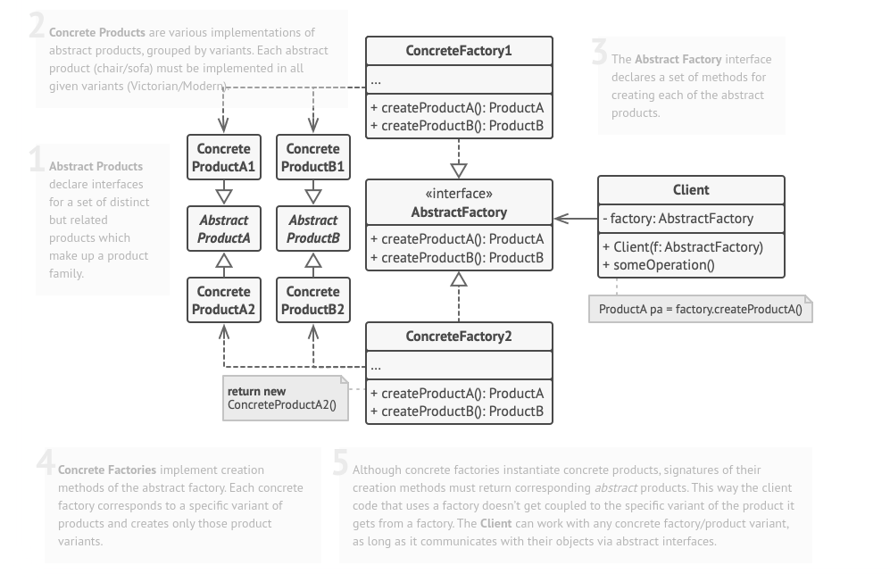

# AbstractPlanner

Abstract planner is a design pattern that provides an interface for creating families of related or dependent objects. 
Four things are crucial in abstract design pattern. They are concrete product, concrete factory, abstract product, abstract factory
abstract factories gives an interface for generating entities that are related to a family but in a way the client who asks for it need not worry about the group.
concrete factories are the ones that are in charge of deleivering each product related to that group
abstract product gives an interface that all products of a group must follow in an abstact way
concrete product is the actual instance of object that will be created by concrete factory specific to factory's product family.

